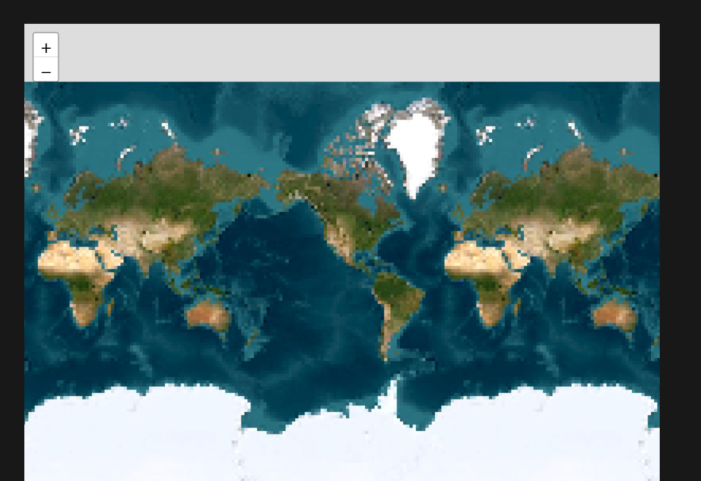

# maps-pixel-filter
A small npm package that adds a filter to make leaflet maps pixelated for fun, why not! ¯\\_(ツ)_/¯

Example
```
import L from 'leaflet';
import 'maps-pixel-filter'; // modifies L globally

const map = L.map('map').setView([51.505, -0.09], 13);

L.tileLayer.pixelated('https://{s}.tile.openstreetmap.org/{z}/{x}/{y}.png', {
    attribution: '&copy; <a href="https://www.openstreetmap.org/copyright">OpenStreetMap</a> contributors',
    pixelationFactor: 4 // this is default 8
}).addTo(map);
```


